# Portafolio Galería

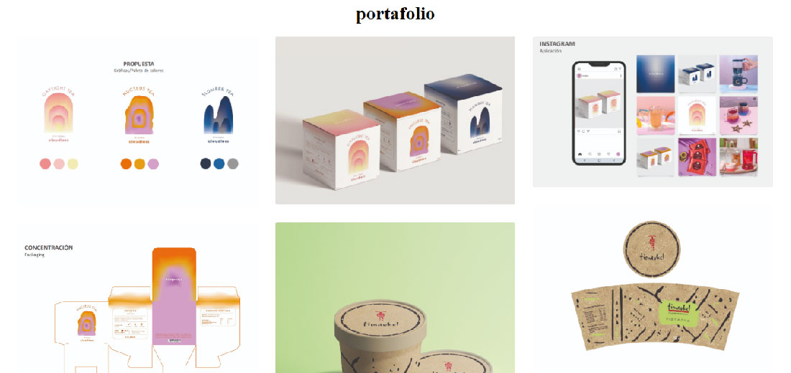
-----
### Para utilizar este template deberás seguir los siguientes pasos que se dividen en:
1. Crear tu repositorio
2. Organizar tus archivos
3. Subir tus archivos 
4. Obtener link para tu sitio web

-----
### 1. Crea tu repositorio
Pulsa _**Use this template**_ (usar esta plantilla) y luego en la pestaña _Create a new repository_ (crear nuevo repositorio).

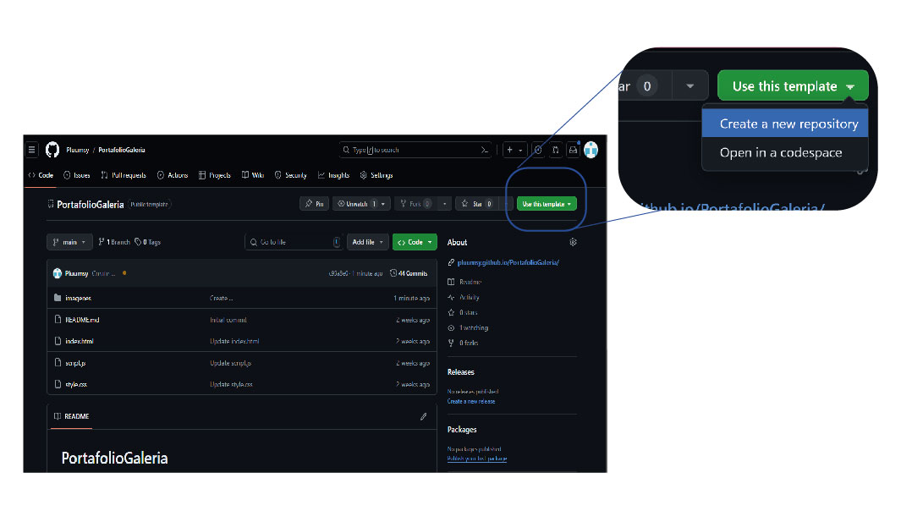

Ponle el nombre que desees que esté disponible y pulsa _**Create repository**_ (crear repositorio).

\*Asegúrate de seleccionar _**Include all branches**_ (incluir todas las ramas).

Listo! tendrás tu repositorio creado

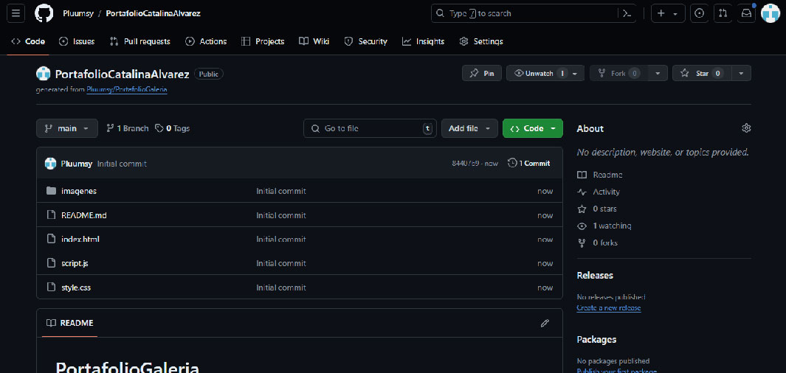

-----

### 2. Organiza tus archivos

Primero deberás crear una carpeta en la tengas todas las imágenes que desees subir 

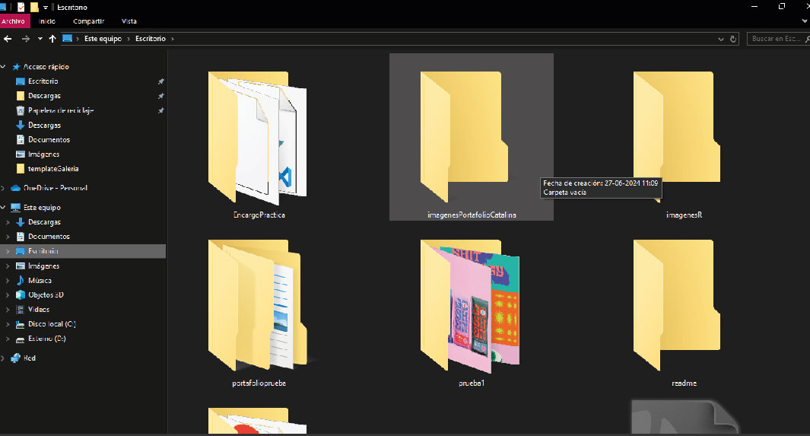

En esta carpeta tendrás que cambiar los nombres de los archivos segun sea el orden en el que quieras que se visualicen

La nomenclatura (nombre) de los archivos deben ser imagen+ números de dos dígitos, (01-02-03…-10-11-12) .formato a elección
- Ejemplo: imagen06.jpg

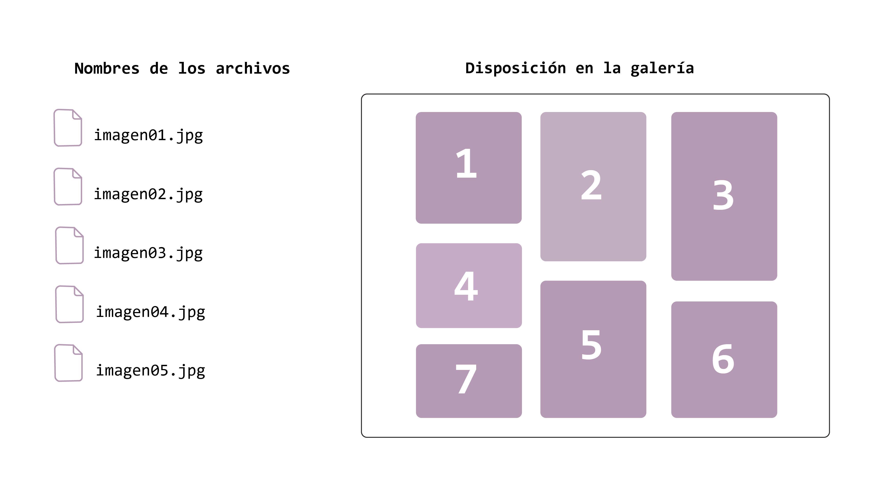

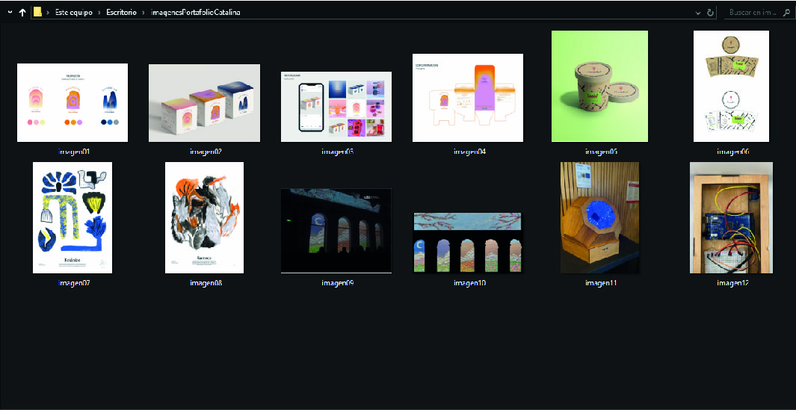

### 3. Sube tus archivos

En tu repositorio, ingresa a la carpeta _**imagenes**_.

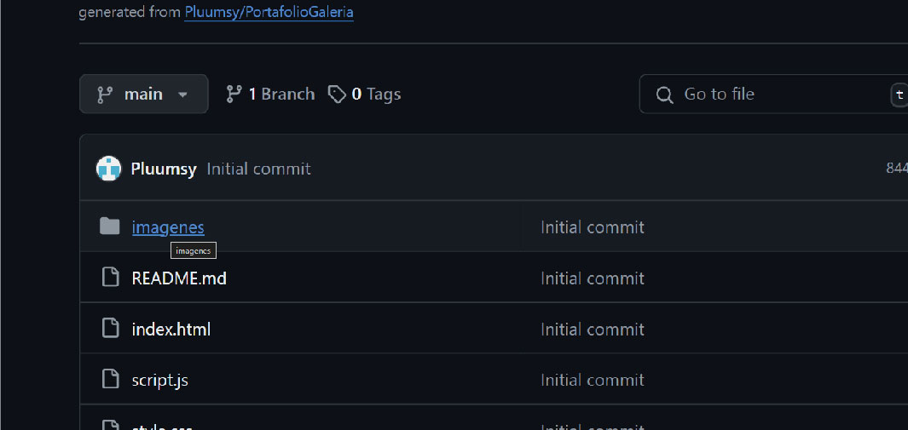

Presiona _**Add file**_ (añadir archivos) y luego _**Upload files**_ (cargar archivos).

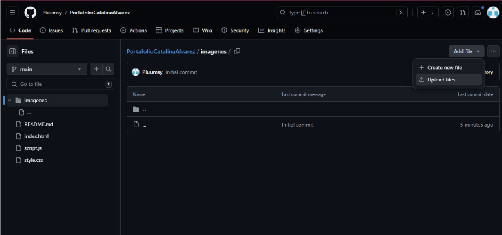

Sube los archivos de tus proyectos, arrastrándolos o presionando _**choose your files**_ (elige tus archivos).

Luego presiona _**Commit changes**_ (hacer los cambios) para que estén en la carpeta de imágenes.

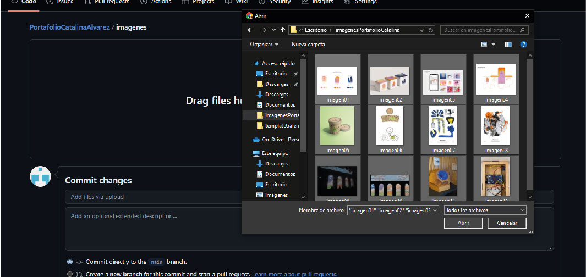

-----

### 4. Obtener link para tu sitio web

Para obtener el _**link**_ (enlace) a la visualización de tu plantilla, presiona en _**Settings**_ (configuraciones) y luego _**Pages**_ (páginas).

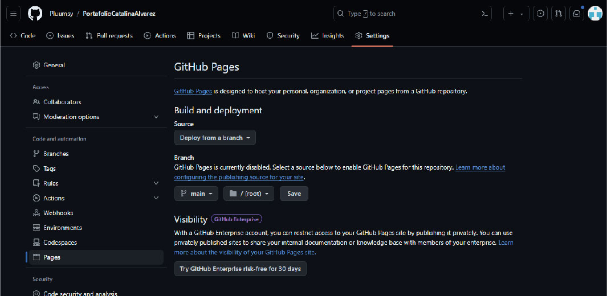

Y luego cambia _**None**_ (ninguno) por _**Main**_ (principal) y _Github_ creará tu _**website**_ (sitio web). Para finalizar presiona _**Save**_ (guardar).

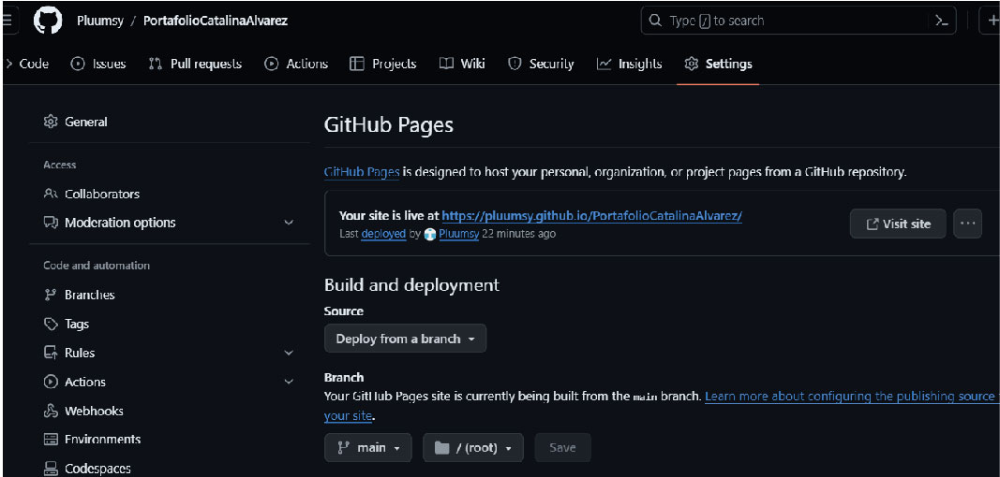

Finalmente con este link podrás ingresar a tu sitio web y visualizar tu Portafolio

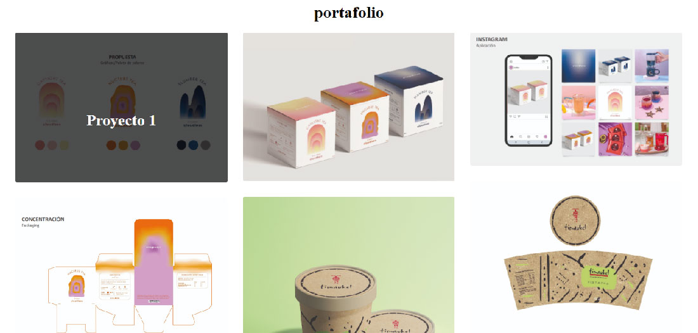

